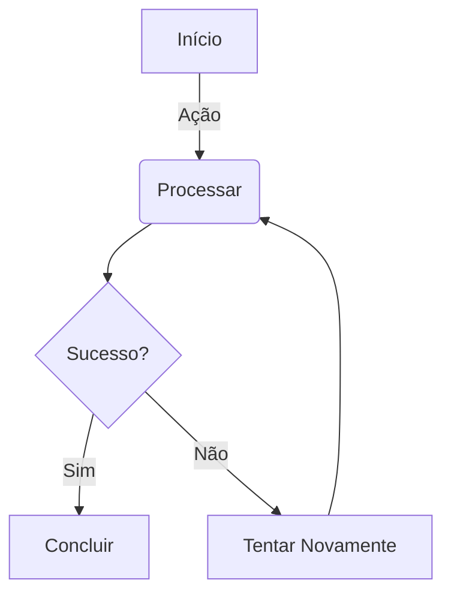

Bem-vindo à demonstração dos recursos. Abaixo você verá como este tema transforma Markdown simples em documentação rica e interativa.

## 1. Callouts (Alertas)

Use callouts para destacar informações críticas. O Hextra suporta estilos do GitHub e ícones personalizados.


**Informação:** Este é um callout padrão para notas gerais.



**Aviso:** Fique atento a detalhes importantes que o usuário não deve perder.



**Erro:** Algo crítico que requer ação imediata.


---

## 2. Passos (Tutorial Interativo)

O componente `steps` é perfeito para tutoriais ou guias de instalação. Ele numera automaticamente e conecta os itens visualmente.

{}

### Passo 1: Instalar o Hugo
Primeiro, certifique-se de que você tem o Hugo instalado em sua máquina.

### Passo 2: Clonar o Repositório
Baixe o tema Hextra para o seu projeto.

### Passo 3: Configurar e Rodar
Adicione o tema ao seu `hugo.toml` e inicie o servidor local.

{}

---

## 3. Abas e Código (Tabs)

Organize instruções para diferentes sistemas ou linguagens sem poluir a página.


  
  ```bash
  npm install hextra-theme
````

{{\< /tab \>}}
{{\< tab \>}}

```bash
pnpm add hextra-theme
```

{{\< /tab \>}}
{{\< tab \>}}

```bash
yarn add hextra-theme
```

{{\< /tab \>}}
{{\< /tabs \>}}

-----

## 4\. Diagramas com Mermaid

O Hextra renderiza diagramas automaticamente. Abaixo, um gráfico de fluxo simples:



-----

## 5\. Matemática (LaTeX)

Fórmulas matemáticas complexas são renderizadas lindamente usando KaTeX.

**Fórmula em Linha:** A famosa equação de Euler é $e^{i\pi} + 1 = 0$.

**Bloco Matemático:**

$$
\int_{-\infty}^{\infty} e^{-x^2} dx = \sqrt{\pi}
$$

-----

## 6\. Árvore de Arquivos (FileTree)

Ótimo para mostrar a estrutura de diretórios de um projeto.

{{\< filetree/container \>}}
{{\< filetree/folder name="meu-site-hugo" \>}}
{{\< filetree/folder name="content" \>}}
{{\< filetree/file name="\_index.md" \>}}
{{\< filetree/folder name="docs" \>}}
{{\< filetree/file name="guia.md" \>}}
{{\< /filetree/folder \>}}
{{\< /filetree/folder \>}}
{{\< filetree/file name="hugo.toml" \>}}
{{\< filetree/folder name="themes" state="closed" \>}}
{{\< filetree/folder name="hextra" \>}}
{{\< /filetree/folder \>}}
{{\< /filetree/folder \>}}
{{\< /filetree/folder \>}}
{{\< /filetree/container \>}}

-----

## 7\. Cartões de Navegação (Cards)

Crie menus visuais ou links rápidos para outras seções da documentação.

{{\< cards \>}}
{{\< card link="\#" title="Guia Rápido" icon="bolt" \>}}
{{\< card link="\#" title="Configuração" icon="settings" \>}}
{{\< card link="\#" title="Plugins" icon="puzzle" \>}}
{{\< /cards \>}}